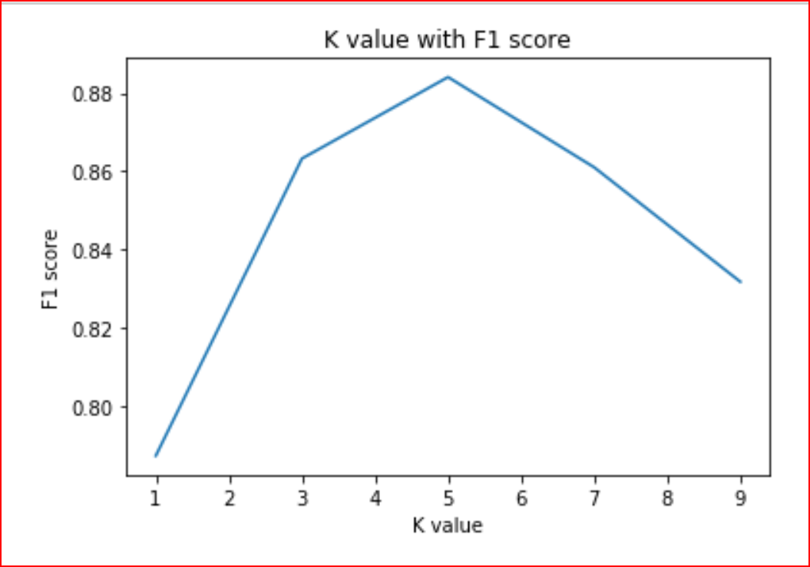
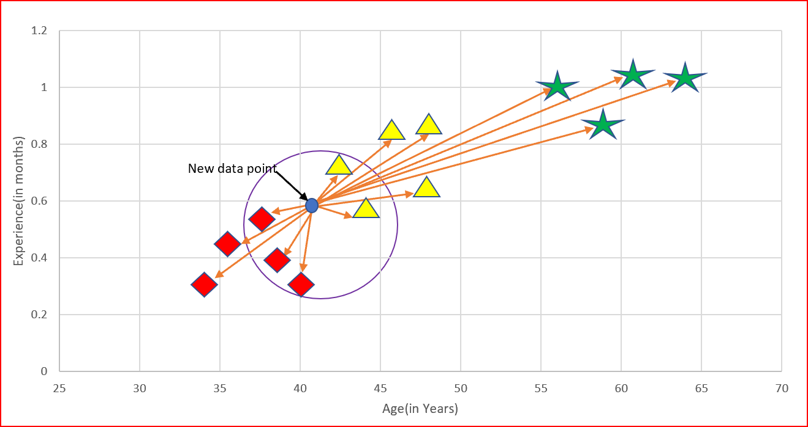

# Diagnosis_Of_Diabetes

Comment lines have been added step by step within the project. (In Turkish Language) Hope it will be a useful study... I decided to publish some of my works in Turkish in this area where Turkish resources are lacking. Therefore, this project will not have a readme file in English.

---
### Şeker Hastalığı Teşhisi Projesi :

* Proje ile ilgili gerekli bilgiler .ipynb dosyasında yer almaktadır. 
* Proje kapsamında kullanılan algoritma K-Nearest Neighbors algoritmasıdır.

--- 
###  K-Nearest Neighbors Algoritması :

K-En Yakın Komşu Algoritması (veya KNN), hem sınıflandırma hem de regresyon sorunlarını çözebilen popüler bir denetimli makine öğrenimi algoritmasıdır. Algoritma oldukça sezgiseldir ve bir tahminde bulunmak için yeni, etiketlenmemiş bir veri noktasına en yakın k komşuyu bulmak için mesafe ölçümlerini kullanır. 
* Sınıflandırma problemlerinde **In classification problems**, KNN algoritması, k komşusunun çoğunluğunun sınıflarına bakarak sonuca varmaktadır. Yani yeni bir veri noktasının sınıfını çıkarmaya çoğunluğun sınıfına bakarak sonuca varacaktır. Örneğin, yeni bir veri noktasının komşularından beşinin sınıfı "Beyaz" iken yalnızca ikisinin sınıfı "Siyah" ise, algoritma yeni veri noktasının sınıfının "Beyaz" olduğunu tahmin edecektir.
* Regresyon problemlerinde **In regression problems**, KNN algoritması, k komşunun değerlerinin ortalamasını döndürerek yeni bir veri noktasının sürekli değerini tahmin edecektir. Örneğin, en yakın beş komşu [100, 105, 95, 100, 110] değerine sahipse, algoritma bu beş değerin ortalaması olan 102 değerini döndürür.

###  K-Nearest Neighbors Algoritması Neden Öğrenilmeli? :

Öncelikle: Hem Sınıflandırma hem de Regresyon için kullanılır
Yeni noktanın içine düşeceği kümeyi tahmin etmek için özellik benzerliğini kullanır.

KNN algoritmasının öğrenmek için harika olmasının üç sebebine bakalım:

* **1.)** Görselleştirmesi kolay, sezgisel bir algoritmadır. Bu, yeni başlayanlar için öğrenmeyi harika ve teknik olmayan kitlelere açıklamayı kolaylaştırır.
* **2.)** Hem regresyon hem de sınıflandırma problemlerine uygulanabildiği için çok yönlüdür.
* **3.)** Algoritma nispeten küçük veri setleriyle çalışabilir ve oldukça hızlı çalışabilir. 

###  K-Nearest Neighbors Algoritması Nasıl Çalışır? :

Gerçek hayattan bir örnek alalım ve anlayalım:

Yeni bir mahalleye taşındınız ve komşularınızla arkadaş olmak istiyorsunuz. Komşularınızla sosyalleşmeye başlarsınız. Düşüncelerinize, ilgi alanlarınıza ve hobilerinize uygun komşular seçmeye karar veriyorsunuz. Burada düşünme, ilgi ve hobi özelliklerdir. İlgi, hobi ve düşünce benzerliğine göre mahalle arkadaş çevrenize karar verirsiniz. Bu, KNN'nin nasıl çalıştığına benzer

### K nedir, K en yakın komşu?

K, yeni veri noktası için benzer komşuları tanımlamak için kullanılan bir sayıdır.
Yeni mahallemizdeki arkadaş çevresi örneğimize atıfta bulunarak. Ortak düşünce veya hobilere göre çok yakın arkadaş olmasını istediğimiz 3 komşu seçiyoruz. Bu durumda K, 3'tür.
KNN, yeni veri noktasının nereye ait olduğuna karar vermek için en yakın K komşusunu alır. Bu karar, özellik benzerliğine dayanmaktadır.

Bir makine öğrenimi projesini yürütüyorsanız ve KNN Algoritmaasını kullanıyorsanız aşağıdakileri kritik maddeleri belirlemek sizin işiniz:

* Hangi benzerlik ölçüsünün kullanılacağı...
* Bakılacak komşu sayısı (k)...
* Verilerinizin hangi özellikleri en önemli değerlendirme kriteri sayılır...
* Ve benzeri etkenler...

### K değerini nasıl seçeriz?

  

* K'nin seçimi, KNN'den elde ettiğimiz sonuçlar üzerinde büyük bir etkiye sahiptir.

* Test setini alabilir ve doğruluk oranını veya F1 puanını farklı K değerlerine karşı çizebiliriz.

* K=1 olduğunda test seti için yüksek bir hata oranı görüyoruz. Dolayısıyla, k=1 olduğunda modelin fazla uyuştuğu sonucuna varabiliriz.

* Yüksek bir K değeri için F1 puanının düşmeye başladığını görüyoruz. Test seti, k=5 olduğunda minimum hata oranına ulaşır. Bu, K-araçlarında kullanılan dirsek yöntemine çok benzer.

* Test hata oranının dirseğindeki K değeri bize optimal K değerini verir.

### KNN nasıl çalışır?

Bir organizasyonda yaş ve deneyime sahibiz. Yaşı ve tecrübesi uygun olan yeni bir adayın maaşını tahmin etmek istiyoruz.

* Adım 1: K için bir değer seçin. K tek sayı olmalıdır.
* Adım 2: Yeni noktanın eğitim verilerinin her birine olan mesafesini bulun.
* Adım 3:Yeni veri noktasına en yakın K komşuyu bulun.
* Adım 4: Sınıflandırma için, k komşu arasında her kategorideki veri noktalarının sayısını sayın. Yeni veri noktası, en fazla komşuya sahip sınıfa ait olacaktır.

Regresyon için, yeni veri noktasının değeri k komşunun ortalaması olacaktır.

  


### K-En Yakın Komuş Mesafesi Nasıl Hesaplanır?

* Öklid mesafesi
* Manhattan mesafesi
* Hamming Mesafesi
* Minkowski Mesafesi
* Öklid uzaklığı, iki nokta arasındaki uzaklığın karesinin toplamının kareköküne eşittir. L2 normu olarak da bilinir.


###  K-Nearest Neighbors Algoritmasını Projemde Nasıl Kullanabilirim? :

KNN algoritmasından yararlanmak için popüler Scikit-Learn (sklearn) Modülünün nasıl kullanılacağını bilmeniz gerekir. Başlamak için, bazı kritik modülleride projenizde bulundurmalısınız. (Aynı zamanda o kritik modüllerin kullanımı ile ilgili bilgi sahibi olmanız gerekmektedir.) Keza: pandas, numpy vb... Bu modüller veri bilimi, yapay zeka, makine öğrenmesi, derin öğrenme gibi alanlarda oldukça yaygın bir biçimde kullanılmaktadır.

```console
import pandas as pd #Örnek1, kritik modül
from sklearn.neighbors import KNeighborsClassifier #KNN İmport işlemi
from seaborn import load_dataset #Örnek2, kritik modül
```
---
